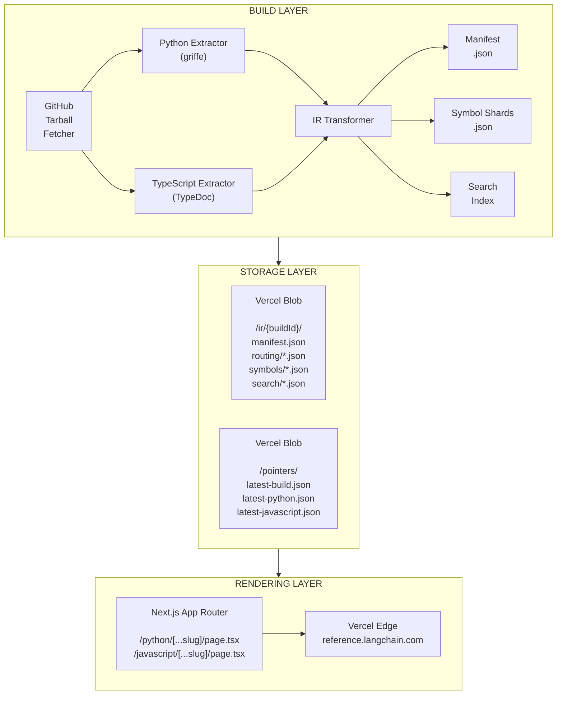

# LangChain Reference Documentation Platform

A unified API reference documentation platform for LangChain Python and JavaScript/TypeScript packages. This platform extracts API documentation from source code, generates a normalized Intermediate Representation (IR), and renders a Next.js application with a consistent, beautiful UI.

[](https://github.com/langchain-ai/langchain-reference-docs/actions/workflows/build.yml)
[](https://reference.langchain.com)

## Overview

This monorepo contains everything needed to build and serve unified API reference documentation for:

- **Python packages**: `langchain`, `langchain-core`, `langchain-community`, and provider integrations
- **JavaScript/TypeScript packages**: `@langchain/core`, `@langchain/openai`, `@langchain/anthropic`, and more

### Key Features

- 🔄 **Unified Interface**: Single consistent UI for both Python and TypeScript documentation
- 📦 **Static Extraction**: Parse APIs without runtime imports using griffe (Python) and TypeDoc (TypeScript)
- 🚀 **Immutable Builds**: Content-addressed builds from any Git SHA for reproducibility
- 🔍 **Fast Search**: Client-side search with MiniSearch across all symbols
- 🎨 **Mintlify-like Design**: Modern, clean UI matching LangChain's documentation theme
- 🌓 **Dark Mode**: Full dark mode support with automatic system preference detection

## Architecture



## Project Structure

```txt
langchain-reference-docs/
├── apps/
│   └── web/                          # Next.js application
│       ├── app/                      # App Router pages
│       │   ├── (ref)/                # Reference docs route group
│       │   │   ├── python/           # Python package pages
│       │   │   └── javascript/       # JavaScript package pages
│       │   └── api/                  # API routes
│       ├── components/               # React components
│       │   ├── layout/               # Header, Sidebar, etc.
│       │   ├── reference/            # Symbol rendering components
│       │   └── search/               # Search modal and results
│       └── lib/                      # Utilities and data loading
│
├── packages/
│   ├── ir-schema/                    # Shared TypeScript types for IR
│   ├── extractor-python/             # Python API extractor (griffe)
│   └── extractor-typescript/         # TypeScript API extractor (TypeDoc)
│
├── scripts/                          # Build pipeline scripts
│   ├── build-ir.ts                   # Main build orchestrator
│   ├── fetch-tarball.ts              # GitHub tarball fetcher
│   ├── upload-ir.ts                  # Vercel Blob uploader
│   └── update-kv.ts                  # Build pointer updater
│
├── configs/                          # Build configurations
│   ├── langchain-python.json         # LangChain Python packages
│   ├── langchain-typescript.json     # LangChain TypeScript packages
│   ├── langgraph-python.json         # LangGraph Python packages
│   ├── langgraph-typescript.json     # LangGraph TypeScript packages
│   └── *-versions.json               # Cached version/tag data
│
└── .github/
    └── workflows/
        └── build.yml                 # GitHub Actions workflow
```

## Legacy URL Redirects (Backwards Compatibility)

When replacing the legacy reference sites, we maintain **301 redirects** from common historical URL shapes into the new canonical routes:

- **Python legacy docs**: `.html` pages (e.g. `langchain_core/messages.html`) and `/python/integrations/...`
- **JavaScript legacy docs (TypeDoc)**: `modules/*`, `classes/*`, `interfaces/*` pages (e.g. `_langchain_openai.ChatOpenAI.html`)
- **Old Python v0.3 docs**: `/v0.3/python/**` is mapped best-effort into `/python/**` and may attach a `?v=0.3.x` query param when resolvable

Redirect logic lives in `apps/web/middleware.ts` with pure mapping helpers in `apps/web/lib/utils/legacy-redirects.ts`.
Limitations:

- **Hash fragments** (`#...`) cannot be preserved by edge redirects.

## Quick Start

### Prerequisites

- **Node.js** 24+ (see `.nvmrc`)
- **pnpm** 10+
- **Python** 3.11+ (for Python extractor)

### Installation

```bash
# Clone the repository
git clone https://github.com/langchain-ai/langchain-reference-docs.git
cd langchain-reference-docs

# Install dependencies
pnpm install

# Install Python dependencies (for Python extractor)
pip install griffe
```

### Development

```bash
# Start the development server
pnpm dev

# The app will be available at http://localhost:3000
```

### Building IR Locally

```bash
# Build TypeScript IR (local mode - generates to ./ir-output/, no cloud upload)
pnpm build:ir --local --config ./configs/langchain-typescript.json

# Build Python IR (local mode)
pnpm build:ir --local --config ./configs/langchain-python.json

# Build LangGraph Python IR
pnpm build:ir --local --config ./configs/langgraph-python.json

# Build with version history tracking
pnpm build:ir --local --with-versions --config ./configs/langchain-python.json
```

### Production Build

```bash
# Build the Next.js application
pnpm build

# Start the production server
pnpm start
```

## Packages

### `@langchain/reference-web`

The Next.js application that renders the documentation. Located in `apps/web/`.

**Key features:**

- App Router with dynamic routes for Python and JavaScript packages
- Server-side rendering with ISR caching
- Responsive layout with collapsible sidebar
- Full-text search with keyboard navigation (⌘K)
- Dark mode support

### `@langchain/ir-schema`

TypeScript types for the Intermediate Representation. Located in `packages/ir-schema/`.

**Exports:**

- `Manifest` - Build metadata and package list
- `SymbolRecord` - Individual symbol documentation
- `SearchRecord` - Search index entries
- `RoutingMap` - URL to symbol mapping

### `extractor-python`

Python API extractor using griffe for static parsing. Located in `packages/extractor-python/`.

**Features:**

- Static parsing (no runtime imports needed)
- Google-style docstring support
- Type annotation extraction
- Source location tracking

### `extractor-typescript`

TypeScript API extractor using TypeDoc. Located in `packages/extractor-typescript/`.

**Features:**

- Full TypeDoc integration
- Type resolution and formatting
- JSDoc comment extraction
- Source location tracking

## Documented Packages

### Python (from `langchain-ai/langchain`)

| Package                  | Import Path                |
| ------------------------ | -------------------------- |
| langchain                | `langchain`                |
| langchain-core           | `langchain_core`           |
| langchain-community      | `langchain_community`      |
| langchain-text-splitters | `langchain_text_splitters` |

### JavaScript/TypeScript (from `langchain-ai/langchainjs`)

| Package                 | npm Name                  |
| ----------------------- | ------------------------- |
| langchain               | `langchain`               |
| @langchain/core         | `@langchain/core`         |
| @langchain/community    | `@langchain/community`    |
| @langchain/openai       | `@langchain/openai`       |
| @langchain/anthropic    | `@langchain/anthropic`    |
| @langchain/google-genai | `@langchain/google-genai` |
| @langchain/aws          | `@langchain/aws`          |

## URL Structure

The documentation follows a consistent URL pattern:

```txt
/python/{package}/                     # Package index
/python/{package}/{symbolName}         # Symbol page

/javascript/{package}/                 # Package index
/javascript/{package}/{symbolName}     # Symbol page
```

Examples:

- `/python/langchain-core/` - langchain-core package index
- `/python/langchain-core/ChatOpenAI` - ChatOpenAI class page
- `/javascript/langchain_core/` - @langchain/core package index
- `/javascript/langchain_openai/ChatOpenAI` - ChatOpenAI class page

## Build Pipeline

The build pipeline extracts documentation from source repositories:

1. **Fetch**: Download source tarball from GitHub at a specific SHA
2. **Extract**: Run language-specific extractors (griffe/TypeDoc)
3. **Transform**: Convert to normalized IR format
4. **Upload**: Store in Vercel Blob (or local filesystem)
5. **Index**: Update build pointers in Vercel Blob

### Build Commands

```bash
# Full build with upload (requires BLOB_READ_WRITE_TOKEN)
pnpm build:ir --config ./configs/langchain-typescript.json

# Local-only build (no upload, generates to ./ir-output/)
pnpm build:ir --local --config ./configs/langchain-typescript.json

# Build by project (all configs for a project)
pnpm build:ir --project langchain --local

# Build by language (all configs for a language)
pnpm build:ir --language python --local

# Build all configurations
pnpm build:ir --all --local

# Build specific SHA
pnpm build:ir --config ./configs/langchain-typescript.json --sha abc1234 --local

# Build with version history tracking
pnpm build:ir --config ./configs/langchain-python.json --with-versions --local

# Force rebuild (ignore up-to-date check)
pnpm build:ir --config ./configs/langchain-python.json --force --local

# Show all available options
pnpm build:ir --help
```

### Build Configuration

Build configs are JSON files in `configs/`:

```json
{
  "language": "typescript",
  "repo": "langchain-ai/langchainjs",
  "packages": [
    {
      "name": "@langchain/core",
      "path": "libs/langchain-core",
      "entryPoints": ["auto"]
    }
  ]
}
```

## Search

The platform includes full-text search powered by MiniSearch:

- **Keyboard shortcut**: `⌘K` (Mac) or `Ctrl+K` (Windows/Linux)
- **Language toggle**: Switch between Python and JavaScript results
- **Keyboard navigation**: Arrow keys to navigate, Enter to select
- **Real-time results**: Results update as you type

The search index is built from symbol metadata during the IR build process.

## Design System

The UI follows LangChain's brand guidelines:

### Colors

| Token      | Light            | Dark                   |
| ---------- | ---------------- | ---------------------- |
| Primary    | `#2F6868` (Teal) | `#84C4C0` (Light Teal) |
| Background | `#FAFAF8`        | `#0D0D0D`              |
| Text       | `#1C1C1C`        | `#FAFAFA`              |
| Accent     | `#D4A574` (Gold) | `#D4A574` (Gold)       |

### Typography

- **Headings**: Manrope
- **Body**: Inter
- **Code**: JetBrains Mono

## API Routes

### `POST /api/build`

Trigger an IR build via GitHub Actions.

**Request:**

```json
{
  "language": "typescript" | "python" | "both",
  "sha": "optional-git-sha"
}
```

**Headers:**

```txt
Authorization: Bearer <BUILD_API_TOKEN>
```

### `GET /api/build`

Get recent build status.

### `GET /api/search/query`

Search symbols.

**Query Parameters:**

- `q` - Search query (required)
- `language` - `python` or `javascript` (required)
- `limit` - Max results (default: 20)
- `kind` - Filter by symbol kind
- `packageId` - Filter by package

## Contributing

See [CONTRIBUTING.md](./CONTRIBUTING.md) for guidelines on:

- Setting up the development environment
- Running tests
- Submitting pull requests
- Deployment procedures

## License

This project is part of the LangChain ecosystem. See the [LICENSE](./LICENSE) file for details.

## Related Projects

- [LangChain](https://github.com/langchain-ai/langchain) - Python LLM framework
- [LangChainJS](https://github.com/langchain-ai/langchainjs) - JavaScript/TypeScript LLM framework
- [LangChain Documentation](https://docs.langchain.com) - Main documentation site
- [LangSmith](https://smith.langchain.com) - LLM observability platform
