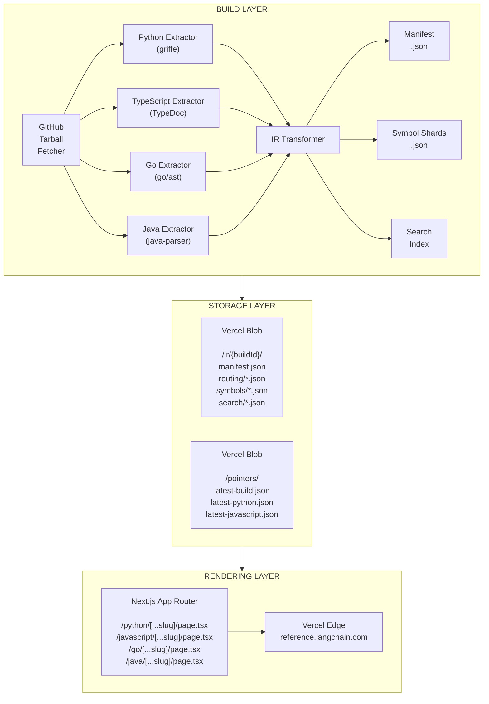

# LangChain Reference Documentation Platform

A unified API reference documentation platform for LangChain packages across Python, JavaScript/TypeScript, Go, and Java. This platform extracts API documentation from source code, generates a normalized Intermediate Representation (IR), and renders a Next.js application with a consistent, beautiful UI.

[](https://github.com/langchain-ai/langchain-reference-docs/actions/workflows/build.yml)
[](https://reference.langchain.com)

## Overview

This monorepo contains everything needed to build and serve unified API reference documentation for:

- **Python packages**: `langchain`, `langchain-core`, `langgraph`, `langsmith`, `deepagents`, and 40+ provider integrations
- **JavaScript/TypeScript packages**: `@langchain/core`, `@langchain/langgraph`, `@langchain/openai`, `@langchain/anthropic`, and more
- **Go packages**: `langsmith-go` for LangSmith tracing and observability
- **Java packages**: `langsmith-java` for LangSmith integration in JVM environments

### Key Features

- 🔄 **Unified Interface**: Single consistent UI for Python, TypeScript, Go, and Java documentation
- 📦 **Static Extraction**: Parse APIs without runtime imports using griffe (Python), TypeDoc (TypeScript), custom Go and Java extractors
- 🚀 **Immutable Builds**: Content-addressed builds from any Git SHA for reproducibility
- 🔍 **Fast Search**: Client-side search with MiniSearch across all symbols
- 🎨 **Mintlify-like Design**: Modern, clean UI matching LangChain's documentation theme
- 🌓 **Dark Mode**: Full dark mode support with automatic system preference detection

## Architecture



## Project Structure

```txt
langchain-reference-docs/
├── apps/
│   └── web/                          # Next.js application
│       ├── app/                      # App Router pages
│       │   ├── (ref)/                # Reference docs route group
│       │   │   ├── python/           # Python package pages
│       │   │   ├── javascript/       # JavaScript package pages
│       │   │   ├── go/               # Go package pages
│       │   │   └── java/             # Java package pages
│       │   └── api/                  # API routes
│       ├── components/               # React components
│       │   ├── layout/               # Header, Sidebar, etc.
│       │   ├── reference/            # Symbol rendering components
│       │   └── search/               # Search modal and results
│       └── lib/                      # Utilities and data loading
│
├── packages/
│   ├── build-pipeline/               # Build pipeline commands and utilities
│   ├── ir-schema/                    # Shared TypeScript types for IR
│   ├── ir-server/                    # Local development IR server
│   ├── extractor-python/             # Python API extractor (griffe)
│   ├── extractor-typescript/         # TypeScript API extractor (TypeDoc)
│   ├── extractor-go/                 # Go API extractor (go/ast)
│   ├── extractor-java/               # Java API extractor (java-parser)
│   └── markdown-utils/               # Markdown processing utilities
│
├── configs/                          # Build configurations
│   ├── langchain-python.json         # LangChain Python packages
│   ├── langchain-typescript.json     # LangChain TypeScript packages
│   ├── langgraph-python.json         # LangGraph Python packages
│   ├── langgraph-typescript.json     # LangGraph TypeScript packages
│   ├── langsmith-python.json         # LangSmith Python SDK
│   ├── langsmith-typescript.json     # LangSmith TypeScript SDK
│   ├── langsmith-go.json             # LangSmith Go SDK
│   ├── langsmith-java.json           # LangSmith Java SDK
│   ├── deepagent-python.json         # Deep Agents Python
│   ├── deepagent-typescript.json     # Deep Agents TypeScript
│   ├── integrations-python.json      # Python provider integrations
│   ├── integrations-typescript.json  # TypeScript provider integrations
│   └── *-versions.json               # Cached version/tag data
│
├── docs/                             # Additional documentation (subpages)
│
└── .github/
    └── workflows/
        ├── build-ir.yml              # IR build workflow
        ├── ci.yml                    # CI workflow
        ├── deploy.yml                # Deployment workflow
        └── perf-tests.yml            # Performance tests
```

## Legacy URL Redirects (Backwards Compatibility)

When replacing the legacy reference sites, we maintain **301 redirects** from common historical URL shapes into the new canonical routes:

- **Python legacy docs**: `.html` pages (e.g. `langchain_core/messages.html`) and `/python/integrations/...`
- **JavaScript legacy docs (TypeDoc)**: `modules/*`, `classes/*`, `interfaces/*` pages (e.g. `_langchain_openai.ChatOpenAI.html`)
- **Old Python v0.3 docs**: `/v0.3/python/**` is mapped best-effort into `/python/**` and may attach a `?v=0.3.x` query param when resolvable

Redirect logic lives in `apps/web/middleware.ts` with pure mapping helpers in `apps/web/lib/utils/legacy-redirects.ts`.
Limitations:

- **Hash fragments** (`#...`) cannot be preserved by edge redirects.

## Quick Start

### Prerequisites

- **Node.js** 24+ (see `.nvmrc`)
- **pnpm** 10+
- **Python** 3.11+ (for Python extractor)
- **Go** 1.21+ (for Go extractor, optional)
- **Java** 11+ (for Java extractor, optional)

### Installation

```bash
# Clone the repository
git clone https://github.com/langchain-ai/langchain-reference-docs.git
cd langchain-reference-docs

# Install dependencies
pnpm install

# Install Python dependencies (for Python extractor)
pip install griffe
```

### Development

First, you need to download the IR data from Vercel Blob storage:

```bash
# Download IR data (requires BLOB_URL or BLOB_READ_WRITE_TOKEN in .env.local)
pnpm pull-ir
```

Then start the development environment:

```bash
# Start both the IR server and Next.js dev server
pnpm dev

# The app will be available at http://localhost:3000
# The IR server runs at http://localhost:3001
```

**Environment Setup:**

Create a `.env.local` file with:

```bash
# Local development - points to the local IR server
BLOB_URL=http://localhost:3001

# For pull-ir command (to download data)
# Get this from Vercel Blob settings
BLOB_READ_WRITE_TOKEN=vercel_blob_rw_xxxxx
```

**Architecture:**

The development environment uses the same HTTP-based loading as production:

- `pnpm serve-ir` runs a local Express server that serves files from `ir-output/`
- `BLOB_URL=http://localhost:3001` tells the loader to fetch from the local server
- This unified approach eliminates environment-specific code paths

### Building IR Locally

For local development, use the `build:local` command which handles all the necessary indexing:

```bash
# Build a single package (recommended for quick iteration)
pnpm build:local --config ./configs/langchain-python.json --package langchain_core

# Build all packages in a config
pnpm build:local --config ./configs/langchain-python.json
```

The `build:local` command:

1. Extracts symbols from source code
2. Generates catalog files for package overview pages
3. Creates routing maps for URL resolution
4. Sets up package pointers for the loader
5. Updates project indexes for the sidebar

After building, restart the dev server to see changes:

```bash
pnpm dev
```

**Advanced: Low-level build commands**

For more control, you can use the underlying `build:ir` command directly:

```bash
# Build TypeScript IR (local mode - generates to ./ir-output/, no cloud upload)
pnpm build:ir --local --config ./configs/langchain-typescript.json

# Build Python IR (local mode)
pnpm build:ir --local --config ./configs/langchain-python.json

# Build a specific package
pnpm build:ir --local --config ./configs/langchain-python.json --package langchain_core

# Build LangGraph Python IR
pnpm build:ir --local --config ./configs/langgraph-python.json

# Build LangSmith SDKs (all languages)
pnpm build:ir --local --config ./configs/langsmith-python.json
pnpm build:ir --local --config ./configs/langsmith-typescript.json
pnpm build:ir --local --config ./configs/langsmith-go.json
pnpm build:ir --local --config ./configs/langsmith-java.json

# Build Deep Agents
pnpm build:ir --local --config ./configs/deepagent-python.json
pnpm build:ir --local --config ./configs/deepagent-typescript.json

# Build Provider Integrations
pnpm build:ir --local --config ./configs/integrations-python.json
pnpm build:ir --local --config ./configs/integrations-typescript.json
```

> **Note:** The `build:ir --local` command only generates `symbols.json` and `package.json`.
> It does not create the catalog, routing, or pointer files needed for the web app to function.
> Use `build:local` instead for a complete local build.

**Version History (CI only)**

Building with version history (`--with-versions`) extracts symbols from multiple historical
versions to generate changelogs. This is computationally expensive and should only be run in CI:

```bash
# ⚠️ Takes hours - only run in CI
pnpm build:ir --local --with-versions --config ./configs/langchain-python.json
```

For local development, version history data is downloaded via `pnpm pull-ir` from the
pre-built artifacts in Vercel Blob storage.

### Production Build

```bash
# Build the Next.js application
pnpm build

# Start the production server
pnpm start
```

## Packages

### `@langchain/reference-web`

The Next.js application that renders the documentation. Located in `apps/web/`.

**Key features:**

- App Router with dynamic routes for Python, JavaScript, Go, and Java packages
- Server-side rendering with ISR caching
- Responsive layout with collapsible sidebar
- Full-text search with keyboard navigation (⌘K)
- Dark mode support
- MCP (Model Context Protocol) server endpoint

### `@langchain/build-pipeline`

Build pipeline commands and utilities. Located in `packages/build-pipeline/`.

**Commands:**

- `build-ir` - Main IR extraction orchestrator
- `pull-ir` - Download IR data from Vercel Blob
- `upload-ir` - Upload IR to Vercel Blob storage
- `sync-versions` - Sync version data from package registries
- `update-indexes` - Update project indexes for sidebar
- `update-pointers` - Update build pointers

**Features:**

- Tarball fetching from GitHub
- Diff engine for version history
- Changelog generation
- Subpage processing for documentation

### `@langchain/ir-schema`

TypeScript types for the Intermediate Representation. Located in `packages/ir-schema/`.

**Exports:**

- `Manifest` - Build metadata and package list
- `SymbolRecord` - Individual symbol documentation
- `SearchRecord` - Search index entries
- `RoutingMap` - URL to symbol mapping
- `Language` - Supported language types
- `Project` - Project configuration types

### `@langchain/ir-server`

Local development server for serving IR data. Located in `packages/ir-server/`.

**Features:**

- Express server for local IR file serving
- Enables consistent HTTP-based loading in development
- Runs on port 3001 by default

### `extractor-python`

Python API extractor using griffe for static parsing. Located in `packages/extractor-python/`.

**Features:**

- Static parsing (no runtime imports needed)
- Google-style docstring support
- Type annotation extraction
- Source location tracking

### `extractor-typescript`

TypeScript API extractor using TypeDoc. Located in `packages/extractor-typescript/`.

**Features:**

- Full TypeDoc integration
- Type resolution and formatting
- JSDoc comment extraction
- Source location tracking

### `extractor-go`

Go API extractor using Go's AST parser. Located in `packages/extractor-go/`.

**Features:**

- Static parsing using `go/ast` and `go/parser`
- Function, type, and interface extraction
- Go doc comment parsing
- Source location tracking

### `extractor-java`

Java API extractor using java-parser. Located in `packages/extractor-java/`.

**Features:**

- Java and Kotlin source parsing
- Class, interface, enum, and record extraction
- Javadoc comment parsing
- Annotation extraction
- Generic type handling

### `@langchain/markdown-utils`

Markdown processing utilities. Located in `packages/markdown-utils/`.

**Features:**

- Admonition processing (note, tip, warning, etc.)
- Text dedenting utilities
- Markdown transformation helpers

## Documented Packages

### LangChain

#### Python (from `langchain-ai/langchain`)

| Package                  | Import Path                |
| ------------------------ | -------------------------- |
| langchain                | `langchain`                |
| langchain-core           | `langchain_core`           |
| langchain-community      | `langchain_community`      |
| langchain-text-splitters | `langchain_text_splitters` |

#### JavaScript/TypeScript (from `langchain-ai/langchainjs`)

| Package                 | npm Name                  |
| ----------------------- | ------------------------- |
| langchain               | `langchain`               |
| @langchain/core         | `@langchain/core`         |
| @langchain/community    | `@langchain/community`    |
| @langchain/openai       | `@langchain/openai`       |
| @langchain/anthropic    | `@langchain/anthropic`    |
| @langchain/google-genai | `@langchain/google-genai` |
| @langchain/aws          | `@langchain/aws`          |

### LangGraph

#### Python (from `langchain-ai/langgraph`)

| Package       | Import Path     |
| ------------- | --------------- |
| langgraph     | `langgraph`     |
| langgraph-sdk | `langgraph_sdk` |

#### JavaScript/TypeScript (from `langchain-ai/langgraphjs`)

| Package                  | npm Name                   |
| ------------------------ | -------------------------- |
| @langchain/langgraph     | `@langchain/langgraph`     |
| @langchain/langgraph-sdk | `@langchain/langgraph-sdk` |

### LangSmith

#### Python (from `langchain-ai/langsmith-sdk`)

| Package   | Import Path |
| --------- | ----------- |
| langsmith | `langsmith` |

#### JavaScript/TypeScript (from `langchain-ai/langsmith-sdk`)

| Package   | npm Name    |
| --------- | ----------- |
| langsmith | `langsmith` |

#### Go (from `langchain-ai/langsmith-go`)

| Package   | Import Path                            |
| --------- | -------------------------------------- |
| langsmith | `github.com/langchain-ai/langsmith-go` |

#### Java (from `langchain-ai/langsmith-java`)

| Package   | Maven Artifact |
| --------- | -------------- |
| langsmith | `langsmith`    |

### Deep Agents

#### Python (from `langchain-ai/deepagents`)

| Package        | Import Path      |
| -------------- | ---------------- |
| deepagents     | `deepagents`     |
| deepagents-cli | `deepagents_cli` |

#### TypeScript (from `langchain-ai/deepagents`)

| Package              | npm Name               |
| -------------------- | ---------------------- |
| @langchain/deepagent | `@langchain/deepagent` |

### Provider Integrations

The platform documents 40+ provider integrations for both Python and TypeScript. These include:

**Python Integrations** (from various repos):
Anthropic, OpenAI, AWS, Google GenAI, Cohere, Chroma, Pinecone, Weaviate, MongoDB, Neo4j, Redis, Postgres, Elasticsearch, HuggingFace, Mistral AI, Groq, Fireworks, Ollama, NVIDIA, IBM, Snowflake, Together, Tavily, and more.

**TypeScript Integrations** (from `langchain-ai/langchainjs`):
OpenAI, Anthropic, AWS, Google GenAI, Azure, Cloudflare, Cohere, Exa, Groq, Mistral AI, MongoDB, Nomic, Ollama, Pinecone, Qdrant, Redis, Tavily, Weaviate, and more.

## URL Structure

The documentation follows a consistent URL pattern:

```txt
/python/{package}/                     # Package index
/python/{package}/{symbolName}         # Symbol page

/javascript/{package}/                 # Package index
/javascript/{package}/{symbolName}     # Symbol page

/go/{package}/                         # Package index
/go/{package}/{symbolName}             # Symbol page

/java/{package}/                       # Package index
/java/{package}/{symbolName}           # Symbol page
```

Examples:

- `/python/langchain-core/` - langchain-core package index
- `/python/langchain-core/ChatOpenAI` - ChatOpenAI class page
- `/javascript/langchain_core/` - @langchain/core package index
- `/javascript/langchain_openai/ChatOpenAI` - ChatOpenAI class page
- `/go/langsmith/` - LangSmith Go package index
- `/go/langsmith/Client` - Client type page
- `/java/langsmith/` - LangSmith Java package index
- `/java/langsmith/LangSmithClient` - LangSmithClient class page

## Build Pipeline

The build pipeline extracts documentation from source repositories:

1. **Fetch**: Download source tarball from GitHub at a specific SHA
2. **Extract**: Run language-specific extractors (griffe for Python, TypeDoc for TypeScript, go/ast for Go, java-parser for Java)
3. **Transform**: Convert to normalized IR format
4. **Upload**: Store in Vercel Blob (or local filesystem)
5. **Index**: Update build pointers in Vercel Blob

### Build Commands

```bash
# Full build with upload (requires BLOB_READ_WRITE_TOKEN)
pnpm build:ir --config ./configs/langchain-typescript.json

# Local-only build (no upload, generates to ./ir-output/)
pnpm build:ir --local --config ./configs/langchain-typescript.json

# Build by project (all configs for a project)
pnpm build:ir --project langchain --local
pnpm build:ir --project langsmith --local
pnpm build:ir --project langgraph --local

# Build by language (all configs for a language)
pnpm build:ir --language python --local
pnpm build:ir --language typescript --local
pnpm build:ir --language go --local
pnpm build:ir --language java --local

# Build all configurations
pnpm build:ir --all --local

# Build specific SHA
pnpm build:ir --config ./configs/langchain-typescript.json --sha abc1234 --local

# Build with version history tracking
pnpm build:ir --config ./configs/langchain-python.json --with-versions --local

# Force rebuild (ignore up-to-date check)
pnpm build:ir --config ./configs/langchain-python.json --force --local

# Show all available options
pnpm build:ir --help
```

### Build Configuration

Build configs are JSON files in `configs/`:

```json
{
  "$schema": "./config-schema.json",
  "project": "langsmith",
  "language": "go",
  "repo": "langchain-ai/langsmith-go",
  "packages": [
    {
      "name": "langsmith",
      "path": ".",
      "displayName": "LangSmith Go",
      "versioning": {
        "tagPattern": "v*",
        "maxVersions": 10
      },
      "descriptionSource": "readme",
      "subpages": [
        {
          "slug": "client",
          "title": "Client",
          "source": "docs/langsmith/go/client.md"
        }
      ]
    }
  ]
}
```

**Configuration options:**

- `project` - Project name (langchain, langgraph, langsmith, deepagent, integrations)
- `language` - Language (python, typescript, go, java)
- `repo` - GitHub repository
- `packages` - Array of package definitions
- `externalPackages` - Packages from external repositories (used for integrations)

## Search

The platform includes full-text search powered by MiniSearch:

- **Keyboard shortcut**: `⌘K` (Mac) or `Ctrl+K` (Windows/Linux)
- **Language toggle**: Switch between Python, JavaScript, Go, and Java results
- **Keyboard navigation**: Arrow keys to navigate, Enter to select
- **Real-time results**: Results update as you type

The search index is built from symbol metadata during the IR build process.

## Design System

The UI follows LangChain's brand guidelines:

### Colors

| Token      | Light            | Dark                   |
| ---------- | ---------------- | ---------------------- |
| Primary    | `#2F6868` (Teal) | `#84C4C0` (Light Teal) |
| Background | `#FAFAF8`        | `#0D0D0D`              |
| Text       | `#1C1C1C`        | `#FAFAFA`              |
| Accent     | `#D4A574` (Gold) | `#D4A574` (Gold)       |

### Typography

- **Headings**: Manrope
- **Body**: Inter
- **Code**: JetBrains Mono

## API Routes

### `POST /api/build`

Trigger an IR build via GitHub Actions.

**Request:**

```json
{
  "language": "typescript" | "python" | "go" | "java" | "all",
  "sha": "optional-git-sha"
}
```

**Headers:**

```txt
Authorization: Bearer <BUILD_API_TOKEN>
```

### `GET /api/build`

Get recent build status.

### `GET /api/search/query`

Search symbols.

**Query Parameters:**

- `q` - Search query (required)
- `language` - `python`, `javascript`, `go`, or `java` (required)
- `limit` - Max results (default: 20)
- `kind` - Filter by symbol kind
- `packageId` - Filter by package

## Contributing

See [CONTRIBUTING.md](./CONTRIBUTING.md) for guidelines on:

- Setting up the development environment
- Running tests
- Submitting pull requests
- Deployment procedures

## License

This project is part of the LangChain ecosystem. See the [LICENSE](./LICENSE) file for details.

## Related Projects

- [LangChain](https://github.com/langchain-ai/langchain) - Python LLM framework
- [LangChainJS](https://github.com/langchain-ai/langchainjs) - JavaScript/TypeScript LLM framework
- [LangGraph](https://github.com/langchain-ai/langgraph) - Agent orchestration framework
- [LangSmith SDK](https://github.com/langchain-ai/langsmith-sdk) - LLM observability SDK
- [LangChain Documentation](https://docs.langchain.com) - Main documentation site
- [LangSmith](https://smith.langchain.com) - LLM observability platform
